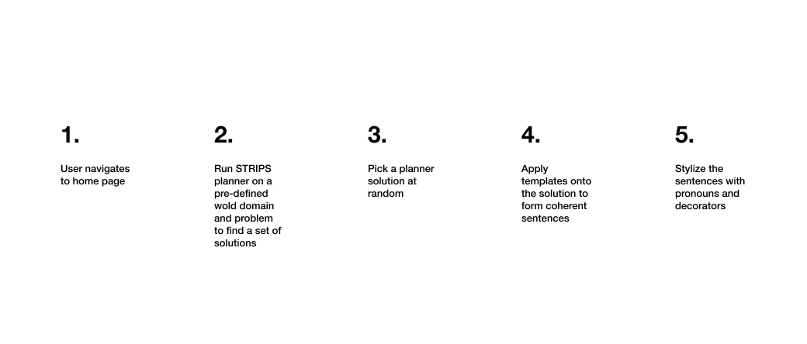

# Small Stories
[Demo]https://small-stories.herokuapp.com/

## Overview
Storytelling is an important aspect of art, literature, and life, as it richly captures the human experience and can convey worlds that stray from reality. This project aims to explore the expressivity of computational narrative through procedural story generation. Furthermore, these computational stories will be visually presented in a storybook format with hand-drawn illustrations. This project is implemented using JavaScript, Next.js, an AI Planner known as the Stanford Research Institute Problem Solver (STRIPS), and hand-drawn art assets. 

## 1. Story Generation
Story generation is executed using the STRIPS planner. Our planning problem involved an initial state, a goal state, and a library of descriptions for all the types of actions that can be performend within the world. The planner is responsible for searching the domain and problem space for valid solutions; in our case, the planning algorithm is simply Breadth First Search (BFS). The planner then outputs each possible solution, where a solution is a sequence of world-coherent steps. We should one solution at random from the set of valid solutions and transform each step in the solution into an English sentence.

The story world centers on a tabby cat. Examples of goal state events, which signal a valid solution to the planner, include when the cat dies, falls in love, or goes to sleep. For a given solution, the planner outputs a sequence of steps. To enforce relatively good performance, I restrict the number of solutions found by the planner to 70, but for the given domain and problem I specified, there are over 200 solutions. The general story generation pipeline is detailed below:

## 2. Story Visualization
Each illustration is hand-drawn, and there are over 20 illustrations! The illustrations are swapped in and out based on the procedural story that is generated by the planner. Illustrations are made to be general enough to apply to various possible sentences i.e. stock images. 

## Resources
- [STRIPS and PDDL](http://www.primaryobjects.com/2015/11/06/artificial-intelligence-planning-with-strips-a-gentle-introduction/)
- [Deploying Next.js with a custom server to Heroku](https://github.com/mars/heroku-nextjs-custom-server-express)
